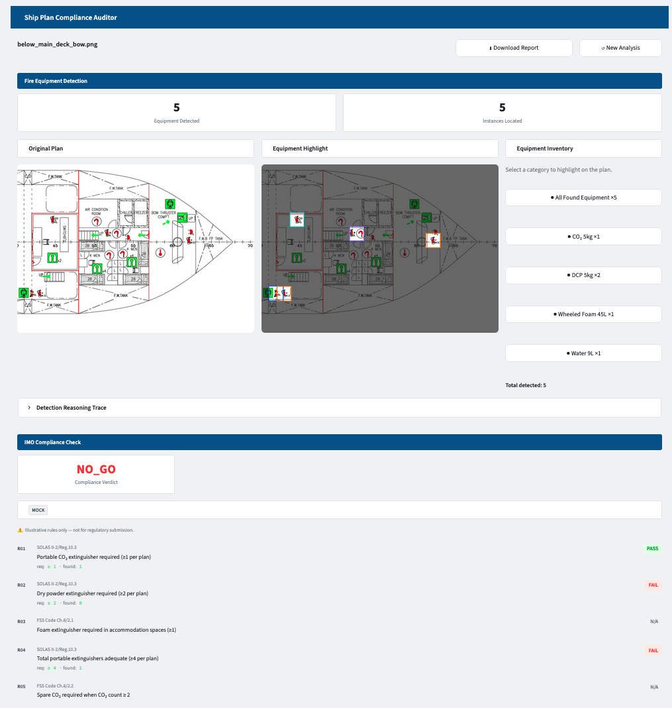

# Ship Plan Compliance Auditor

[](https://github.com/juanita-cao/ship-plan-compliance-auditor/actions/workflows/ci.yml)


**[Live demo →](https://ship-plan-auditor.streamlit.app/)**

An LLM-powered fire-equipment auditor for ship deck plans, built to be **explainable by design**: every run ships with a visible reasoning trace, click-to-locate evidence highlighting on the original plan, and a per-rule compliance verdict with cited regulation articles — so a human reviewer can verify the *why*, not just trust the *what*.

**100% category-level count accuracy** on the validated demo plans, with self-consistency voting and a confidence-tiered gate that automatically routes low-agreement detections to manual review instead of silently guessing.

---

## Demo Preview



---

## What this demonstrates

- **Explainable, audit-first detection — not a black box.** Every result keeps the model's full reasoning trace and exposes click-to-highlight evidence localization: select a category and its exact bounding box lights up on the original plan, cutting the time a human auditor spends hunting for what the model found.
- **Self-consistency for reliability, not just a single LLM call.** The model runs N times per image; per-category counts are reconciled by majority vote, with a calibrated ratio gate that flags low-agreement categories for `MANUAL_REVIEW_REQUIRED` instead of returning an unverified number.
- **A free, deterministic refinement layer alongside the paid model call.** A local OpenCV blob-detection pass corrects instance coordinates without any additional API spend — hybrid LLM + classical CV, not LLM-only.
- **Domain rules layered on top of the detection output.** A small, swappable rule table (modeled loosely on SOLAS/FSS Code extinguisher-count requirements) turns raw counts into a pass/fail/warning verdict per rule plus an overall verdict, each with a cited article.
- **Multi-tenant data model.** Detection categories, compliance rule sets, and demo datasets are looked up per "project" (per ship) from Postgres, not hardcoded — adding a new ship/category set is a data change, not a code change.
- **A real-time generated PDF audit report**, built with `reportlab` from the same ViewModel the UI renders from — not a pre-rendered file read off disk.

> ⚠️ The compliance rule table shipped here is **illustrative only** — built for demonstration purposes, not validated against a current regulatory text. Don't use it for actual regulatory submission.

---

## Architecture

```
Deck plan image ──► E1 vision-LLM detect ──► E1b OpenCV center refine ──┐
                        (N runs)                  (free, local)        │
                                                                        ▼
                                                            E4 majority vote ──┬──► D1 accuracy (eval mode)
                                                                               └──► D2 compliance check
                                                                                          │
                                                                                          ▼
                                                                              E5 report ──► Streamlit + PDF
```

Design documents:
- [`docs/design_backend.md`](docs/design_backend.md) — pipeline table, data contracts, ADRs
- [`docs/design_frontend.md`](docs/design_frontend.md) — state machine, ViewModel, screen flow

## Tech stack

| Layer | Tools |
|---|---|
| LLM / Vision | OpenAI vision API (structured outputs), Ollama (local model option) |
| Detection / CV | OpenCV, NumPy |
| Backend | Python 3.11, Pydantic v2, psycopg3, httpx, tenacity (retry) |
| Data | Postgres (Supabase), multi-tenant category/rule lookup |
| Frontend | Streamlit, Pillow, ViewModel-pattern state management |
| Reporting | ReportLab (server-rendered PDF) |
| Quality / CI | pytest (219 tests), ruff, GitHub Actions |
| Hosting | Streamlit Community Cloud |

Engineering approach (contract-first workflow):

1. Define input/output schemas before implementing pipeline logic.
2. Separate detection execution, validation checks, and decision interpretation (compliance rules) into distinct stages.
3. Preserve raw model outputs (the detection reasoning trace) for inspection rather than discarding them after parsing.
4. Use explicit verification gates before presenting results as decision support (majority voting, local geometric refinement, compliance checks all run before anything is shown to the user).
5. Persist run metadata and structured outputs (Postgres) for reproducibility — the same stored row backs both the live detection path and the demo/mock path, so there is exactly one rendering code path to maintain.
6. Keep the UI layer separate from the detection pipeline through a ViewModel-style interface (`ResultsViewModel`), so the frontend never touches raw pipeline state.

---

## Quickstart

```bash
git clone https://github.com/juanita-cao/ship-plan-compliance-auditor.git
cd ship-plan-compliance-auditor
python -m venv .venv
source .venv/bin/activate
pip install -r requirements.txt
cp .env.example .env   # fill in DATABASE_URL at minimum

# apply schema + seed data to that Postgres instance
psql "$DATABASE_URL" -f src/backend/db/migrations/001_category_lookup.sql
psql "$DATABASE_URL" -f src/backend/db/migrations/002_eval_runs.sql
psql "$DATABASE_URL" -f src/backend/db/seed_data.sql

# run the test suite (219 tests)
pytest -q

# lint
ruff check .

# launch the UI in mock mode (no API key needed — replays a stored
# detection result from Postgres for each demo image)
FEH_MOCK=1 streamlit run src/frontend/app_streamlit.py
```

Requires Python 3.11+ (the codebase uses `X | None` union syntax evaluated at runtime by Pydantic) and a reachable Postgres instance.

CI runs the same lint + test commands against an ephemeral Postgres on every push — see [`.github/workflows/ci.yml`](.github/workflows/ci.yml).

---

## Data note

Sample deck plan images are demo assets with identifying details (hull/IMO numbers, company markings) removed. Compliance rules are illustrative, modeled loosely on SOLAS/FSS Code extinguisher-count requirements — not validated against a current regulatory text, and not a substitute for a real regulatory review.

The detection prompt itself is not included in this repo — a deliberate choice, not an oversight. This means **live mode is not runnable out of the box**; mock mode (Postgres-backed, no API calls) is what powers the hosted demo above and what the preview screenshot reflects.

The evaluation harness (`run_eval.py`) supports comparing a local model (via Ollama) against a cloud model side by side, for cost/accuracy trade-off testing. All results shown in the demo dataset and this repo's docs were produced by the cloud backend; the local-model path is part of the harness's design but wasn't the one exercised for these specific numbers.

---

## Project structure

```
data/             demo deck-plan images + ground-truth counts (2 ship category sets)
docs/             design documents — read before the corresponding code was written
src/backend/      detection pipeline, schemas, compliance rules, Postgres access
src/frontend/     Streamlit UI, ViewModel layer, PDF report generation
tests/            219 tests covering every pipeline stage
```

---

## Current Scope

Implemented:
- Explainable detection: visible reasoning trace + click-to-highlight evidence localization on the original plan
- Vision-LLM detection pipeline with self-consistency majority voting across N runs
- 100% category-level count accuracy on the validated demo plans
- Free, local OpenCV refinement pass for instance coordinates
- Postgres-backed multi-tenant category lookup — adding a ship/category set is a data change, not a code change
- IMO-style compliance rule engine with per-rule GO/NO-GO verdicts and cited articles
- Streamlit UI: mock mode (Postgres-backed, no API calls) + live mode
- Real-time PDF audit report generation from the same ViewModel the UI renders from
- CI: lint + 219 tests against an ephemeral Postgres on every push

Not implemented:
- Live mode is not runnable out of the box in this public repo — no detection prompt is shipped (see [Data note](#data-note)); bring your own to exercise it
- Production-grade compliance rules calibrated against a current regulatory text
- Multi-user authentication or persistent storage beyond the single shared demo database

Per-step implementation status: `docs/design_backend.md` and `docs/design_frontend.md`, each under "Task list and implementation status".
